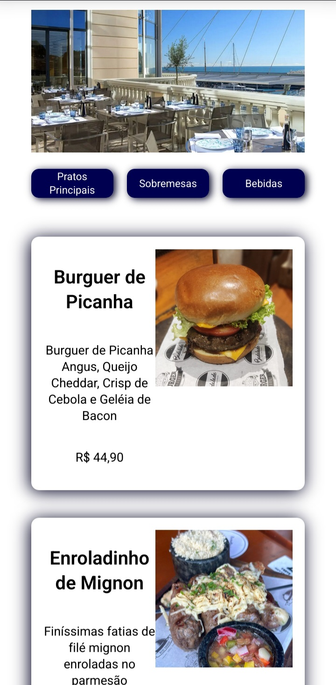
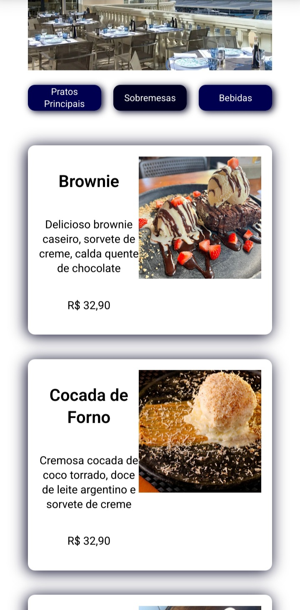
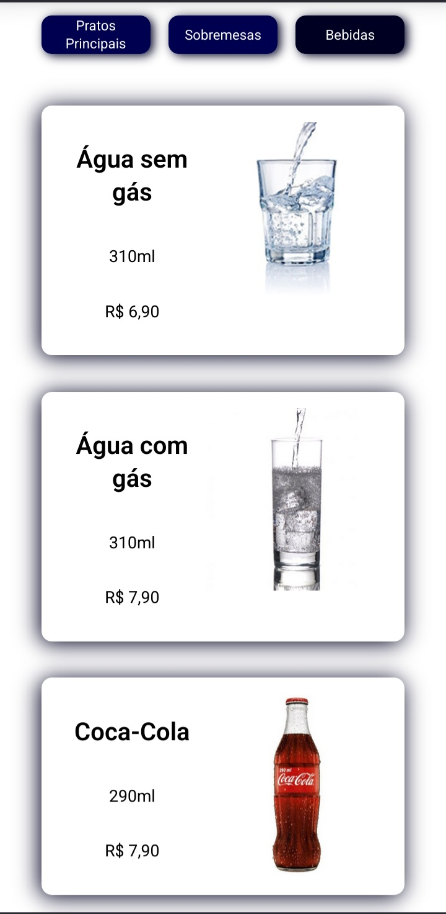

## 🍽 Cardapio Digital
Projeto do terceiro dia do Intensivão de JavaScript da [Hashtag Treinamentos](https://youtube.com/@HashtagProgramacao?si=-M1aRzBpNVh4okNX). Neste projeto conheci um pouco do React e seu controle de states e tive minha primeira experiência com o Vite.js





***
## 🖥 Linguagens usadas
 


***
## ⚒️💻 Ferramentas e Frameworks
[](https://react.dev/)
[](https://vitejs.dev/)
***

## Para Testar
- Clone este repositório com o comando no terminal
```
git clone https://github.com/Iarley-01/    cardapio-digital-react.git
```
- Depois ```cd cardapio-digital-react```    
- ```npm install```
- Por fim ```npm run dev```